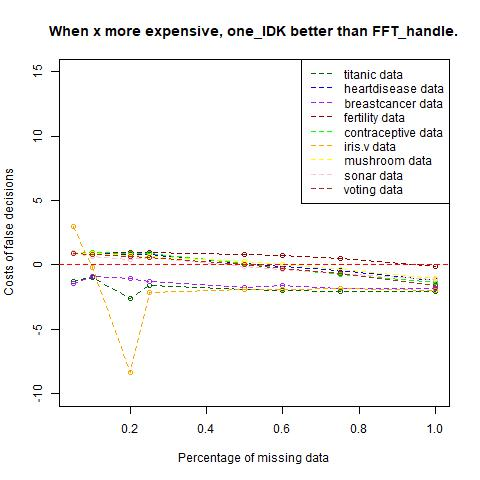
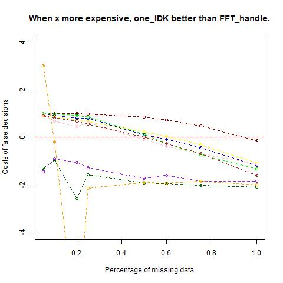
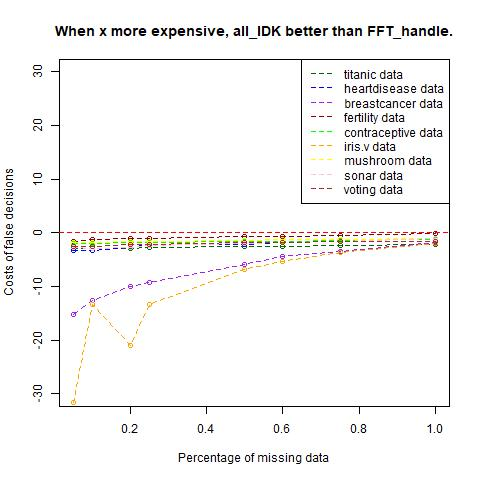
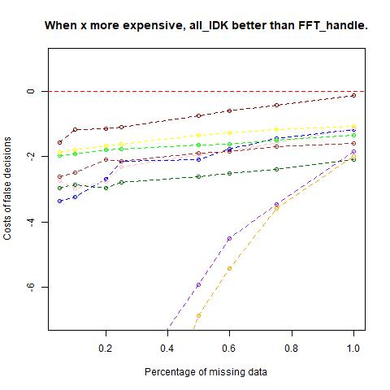
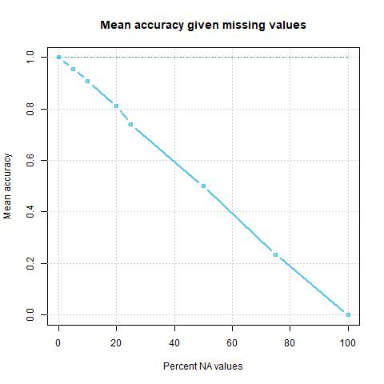
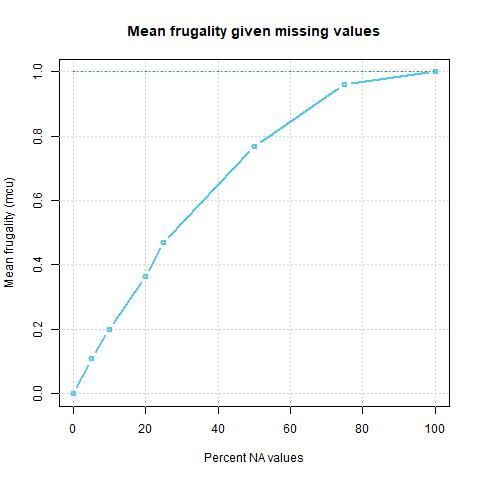

# What we have done so far:

## Theory: 

First Part:
Comparing fast and frugal heuristics with other decision algorithms shows that they often yield predictions as accurate as those from less frugal algorithms in uncertain environments (Phillips et al., 2017).

We hypothesize that the frugal nature of FFTrees confers a comparative advantage in handling incomplete data sets, making it robust in dealing with real-world uncertainties (Gigerenzer & Gaissmaier, 2011). This becomes especially relevant considering the consistent presence of uncertainty in everyday life.
compare with meaning of original:
We hypothesize that due to it's *frugal nature* the comparative advantage of FFTrees lies in its robustness when dealing with incomplete data sets. This seems especially relevant because real-life examples in one's everyday live show consistently that the world is uncertain (Gigerenzer & Gaissmaier, 2011).

Second Part:
Furthermore, it is crucial to consider whether making a decision is appropriate in certain cases. For instance, in scenarios where the consequences of incorrect decisions are substantial, it might be more prudent not to make a decision or categorize cases with missing information on critical predictors.

The performance of potential decision structures/rules can be most effectively measured by calculating expected costs. 

To assess our hypotheses and explore situations where not making a decision may be preferable to deciding under uncertainty, we conducted a comparative analysis of FFTrees' performance under four conditions: handling complete information, handling incomplete information with the FFTrees package, and employing two strategies of not-deciding in similar scenarios.

In future research, we aim to delve deeper into how various algorithms handle similar amounts of missing data and determine which algorithm demonstrates the highest level of robustness in such circumstances.

## Tools:
Aside from using the basic R package "FFTrees", the basic functions "replace_values", "loop_NA", "loop_pc" and "loop_datasets" were developed in order to add defined percentages of NAs to a specific variables of multiple datasets. Also then the best FFTree of the original dataset is applied to several randomly developed "NA-datasets" and it is tested how well the criterion is predicted on average.

## Method:
For this first part (investigating the "I don't know" option), we calculated the performance of FFTrees algorithms for multiple data sets. We got the original best tree and further used it for all investigations.

We then investigated the performance of a "one_IDK" option, that would classify all cases as "I don't know" that had missings in all nodes of the "best tree". (Calculation to determine the number of "IDK" cases: percentage <- pc^nodes)

We further had a look on the performance of the "all_IDK" option which would decide "I don't know for a case as soon as there was a missing value in any of the variables used at the nodes. (Calculation to determine the number of "IDK" cases: percentage <- pc + (1 - pc) * pc + (1 - pc) * (1 - pc) * pc)

Finally we determied the performance of our classic way of handling missings within the FFTree algorithm. 

All performance where compared for their costs: Costs of a right decision were constant with -1. Costs of an "IDK" were constant with 0 and costs of a wrong decision was a variable that was allowed to vary.

The functions of costs for every method would than be compared (points of intersection were determined) and displayed in a graph for different data sest and different percentages of NAs:

We optimized for accuracy.

## Results:

1. Comparing "one_IDK" performance with the performance of the FFT algorithm. 
The x- axis shows the percentage of missing data in each data set, the y-axis displays the costs of wrong decisions (x * -1, meaning: the costs of false decisions have to be x times more bad than correct decisions for the performance to be better/worse than not deciding). The different colours stand for the multiple data sets.

#### Interpretation: 

We have not yet figured out why the performance curve seems to behave quite similar between some, and really different in between other data sets. 
Maybe we can investigate that with correlative calculations between approximated curves of data set performances and multiple variables that could theoretically predict the shape of the performance curve.

Apart from the uncertainty our general take is: 

2. Comparing "all_IDK" performance with the performance of the FFT algorithm. 
The same explanation hold for this graph.

#### Interpretation:

In total we see, ...

Comparing it with performance when optimizing for bacc: 

In comparison, ...

## Discussion:

### What we think now:

### Should a possibility to not decide when all data is missing in all variables be added?

Interpreting the results, it seems that the all_IDK performs worse that the FFT algorithm in all common sense cases.
In contrast, not deciding when all predictive variables are missing for a case seems to produce better performances on average as soon as the costs for a wrong decision are: ...
Although it has to be kept in mind that the variance of this number varies greatly in between data sets due to not yet known factors. Consequently it should be decided data set dependent whether missing data with a certain percentage of missings should be categorized or not.
(unsatisfying answer!)

## Future research:

### What we will investigate further:

- We will find out how other decision algorithms cope with missing data.
- Next, we will compare the performance of the different algorithms when calibrated on a complete data set and then tested with different percentages of missing data. 
- We hypothesize that FFTrees is more robust in its performance than the other algorithms. 

### Further explorations which we did, but which were not included in this summary: 

- Testing for performance when allowing for compensation, i.e. allowing FFTrees to build a better fitting tree when data is missing.
This consistently showed a better performance but was not further investigated since it likely cannot be used in real life easily (when data is missing, criterion might not be known).

- Exploring the performance loss with increasing percentages of missings.
Plot mean results (all used data sets):
Example which shows the normalized results of three data sets (heartdisease, titanic, breastcancer).

