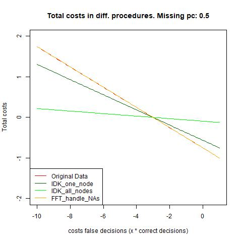

# What we have done so far:

## Fragmented theoretical background: 

##### Topic one (discussed in this summary):

When assessing decision algorithms one must consider whether making a decision at all is advisable. For instance, in scenarios where the consequences of incorrect decisions are substantial, it might be more prudent not to make a decision or categorize cases with missing information regarding critical predictors.

Measuring the effectiveness of potential decision rules is achieved most effectively by calculating expected costs. 

To explore situations where not making a decision may be preferable to deciding under uncertainty, we conducted a comparative analysis of FFTrees' performance under four conditions: handling complete information, handling incomplete information with the FFTrees package, and utilizing two strategies of not-deciding in analogous scenarios.

##### Topic two (Will hopefully be investigated in the future):

Comparisons between fast and frugal heuristics and other decision algorithms have demonstrated that in uncertain environments, the former often yield predictions as accurate as those from less frugal algorithms (Phillips et al., 2017).

We hypothesize that the frugal nature of FFTrees confers a comparative advantage in handling incomplete data sets, making it robust in dealing with real-world uncertainties (Gigerenzer & Gaissmaier, 2011). This is particularly relevant given the persistent presence of uncertainty in everyday life.

In future research, we aim to delve deeper into how various algorithms handle similar amounts of missing data and determine which algorithm demonstrates the highest level of robustness in such circumstances.

## Tools:
Aside from using the R package "FFTrees", the functions "replace_values", "loop_NA", "loop_pc" and "loop_datasets" were developed in order to randomly add defined percentages of NAs to specific variables of multiple data sets. Also, then the best FFTree of the original data set is applied to several randomly developed "NA-data sets" and it is tested how well the criterion is predicted on average with a given percentage of NAs.

## Method:
Regarding topic one, we computed the performance of FFTrees algorithms across multiple data sets, utilizing the original best tree for all subsequent investigations.

We then investigated the performance of a "one_IDK" option, that would classify all cases as "I don't know" that had missings in all nodes of the "best tree". (Calculation to determine the number of "IDK" cases: percentage <- pc of  NAs^nodes)

We further had a look on the performance of the "all_IDK" option which would decide "I don't know" for a case as soon as there was a missing value in any of the variables used at the nodes. (Calculation to determine the number of "IDK" cases: percentage <- pc + (1 - pc) * pc + (1 - pc) * (1 - pc) * pc)

Lastly, we assessed the performance of our conventional approach to managing missing data within the FFTree algorithm. 

All performances were compared for their costs: Costs of a right decision were held constant with -1. Costs of an "IDK" were held constant with 0 and costs of a wrong decision were the x-variable that was allowed to vary.

The functions of costs for every method were than compared (points of intersection were determined) and displayed in a graph for different data sets and different percentages of NAs:

Example for the data set "titanic".

We optimized for accuracy.

## Results:

1. Comparing "one_IDK" performance with the performance of the FFT algorithm. 
The x-axis shows the percentage of missing data in each data set, the y-axis displays the costs of wrong decisions (x * -1, meaning: the costs of false decisions have to be x times as bad as correct decisions for the performance to be better/worse than not deciding). Distinct colours represent different data sets.

#### Interpretation: 

We have not yet figured out why the performance curve seems to behave quite similar between some, and really different in between other data sets. 
Maybe we can investigate that with correlative calculations between approximated curves of data set performances and multiple variables that could theoretically predict the shape of the performance curve.

2. Comparing "all_IDK" performance with the performance of the FFT algorithm. 
The same explanation holds for this graph.

#### Interpretation:

Again, we see a similar pattern. In general, most data sets perform similarly while a few show wildly different patterns. Explanations will hopefully follow.

Interpreting the results, it seems that the all_IDK performs worse than the FFT algorithm in all common sense cases. 
(With common sense, we mean the relationship of costs).
In contrast, not deciding when all predictive variables are missing for a case seems to produce better performances on average for common sense cases. 
Interestingly, the trends of how a bigger percentage of NAs in the data sets influences the performance comparison is antidromic in both cases: The one_IDK case, performs much better than FFT if there is a small percentage of NAs and its comparative advantage shrinks with bigger amounts of NAs, whereas the all_IDK option performance comparatively poorly for small percentages of NAs and improves comparatively with bigger percentages of NAs. It does however never outperform the other options (in common sense scenarios).
Still, keep in mind that these observations vary greatly in between data sets due to not yet known factors.

## Discussion:

To further deploy FFTrees algorithms in dichotomous decisions, it should be considered whether a possibility to not decide when all data is missing in the decisive variables should be added. In some cases the data hints that this could yield cheaper total decision costs on average for some data sets.

## Future research:

Topic one:

- We will attempt to comprehend the patterns governing the varying efficacy of different decision rules, whether involving deciding or not deciding, across diverse data sets with distinct characteristics.

- We could compare performances when optimizing for bacc.

Topic two:

- We will investigate how alternative decision algorithms handle missing data.

- Next, we will compare the performance of different algorithms when calibrated on complete data sets and subsequently tested with varying percentages of missing data.

- We hypothesize that FFTrees exhibit greater robustness in performance compared to other algorithms. 

### Further explorations which we did, but which were not included in this summary: 

- Examining performance when permitting compensation—allowing FFTrees to construct a more suitable tree in the presence of missing data.
This consistently showed a better performance but was not further investigated since it likely cannot be used in real life easily (when data is missing, criterion for good fitting might not be known).

- Exploring the performance loss with increasing percentages of missings.

Here, we depict the mean results from all utilized data sets:

Example which shows the normalized results of three data sets (heartdisease, titanic, breastcancer).

